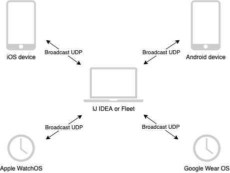

# Hello IDE
Project which enables IDE and mobile devices communication

## Building and running
1. Open in Fleet
2. Run `iosApp`
3. Run `IJ Plugin`

## Modules
- `shared` modules which shares common code between IDE plugins and mobile clients
- `plugin-ij` IJ IDEA plugin
- `plugin-fleet` Fleet plugin, not implemented 🚫
- `composeApp` Android app, not implemented 🚫
- `iosApp` iOS app